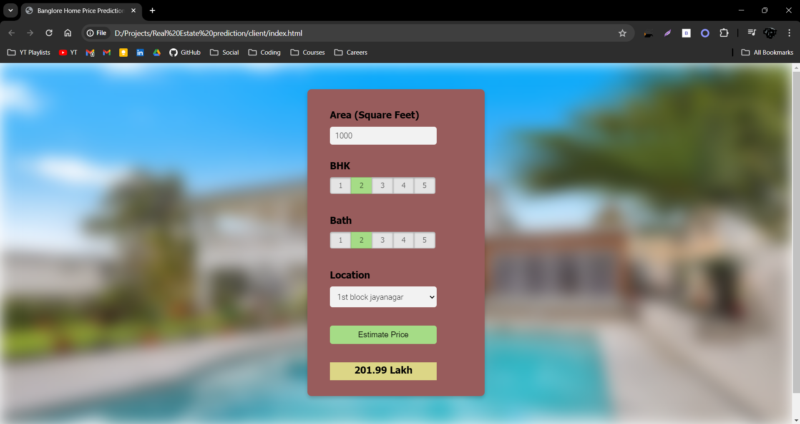

# Real Estate Prediction

Bangalore house prices dataset from kaggle is used in this project



## To run the application
#### Step 1: Download the project. And go the directory.
#### Step 2: Execute the following command in the terminal
```bash
python main.py
```


#
U can execute the project by going to the server folder and run server.py and and run index.html from the client folder.
#

## Python Packages for the project

NumPy\
Pandas\
Scikit-Learn\
Matplotlib\
flask